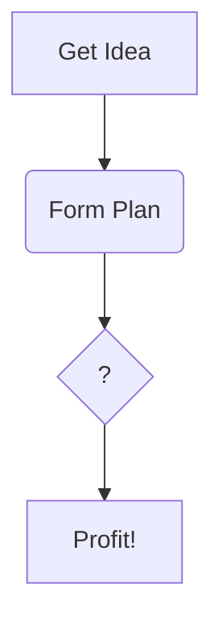

<!-- The title of your document -->
# Documentation Competition Template

<!-- Put your name, at least your Horizon Name, as the author -->
Richard Lee (Shards632)  
<!-- IMPORTANT: Put the date this document was last updated! This is
important information for people to tell how 'stale' this info might 
be.-->
August 17, 2025  

## Introduction

<!-- This section should describe what this document is going to cover. Try to provide some background and motivation as to why a creator would want to read your document. -->

Writing documentation that is clear and concise is not a simple task. This document will attempt to provide you with an outline that you can follow to organize your writing into a way that people can quickly and easily access the information you're providing.

### Prerequisites and Expectations

<!-- This section should indicate any expectations you have of your readers, such as other materials or concepts they should already be familiar with in order to get the most out of your document. -->

You will need a GitHub account to contribute documentation, and you should be familiar with using GitHub Markdown for formatting. Also, it's presumed that as a prerequisite, you have some knowledge about the topic you are about to write a document on.

### Document Organization

<!-- This s an optional section, but possibly useful if your document has unusual document structure, or needs a table of contents with internal links because it is very long. 

Note that github automatically creates a clickable Outline from your section headings. Make sure you properly 'nest' your headings by using ##, ###, ####, #####, etc for sub sections so that the outline has a good hierarchy and makes navigating your document easier. I recommend only using # for the initial title, as the font for H1 renders very large. -->

This document has two parts, that discuss how you would talk about two topics. Additionally there is a reference section at the end. For such a simple document, you probably don't need this section. 

* [Topic One](#topic-one)
* [Topic Two](#topic-two)
* [References](#references)

## Topic One

This is where we discuss the *first* interesting topic of this document.  

### Lists

There might be lists

#### Unordered
- some
  - unordered
  - nested
    - lists
- of
- data

#### Ordered
1. some
   1. ordered
   1. nested
      1. lists
1. of
1. data

### Code

You will likely want to reference code:

```ts
function myFancyFunction(value: number) {
  console.log(`You chose ${value}!`);
}
```

### Images
It might have some images:


## Topic Two

This is where we discuss the **second** interesting topic of this document.

### Tables

An advanced formatting option is tables

| Heading 1 | Heading 2 | Heading 3 |
| --- | --- | --- |
| Data 1 | Data 2 | Data 3 |
| Data 4 | Data 5 | Data 6 |


### Diagrams

Diagrams are a very advanced markdown topic (and may not render correctly in non GitHub previews)



## References

<!-- this is the place to put useful supplementary information, such as references to other websites or documents in the github repo that are relevant to your topic -->

- https://medium.com/shecodeafrica/a-guide-to-technical-writing-7efcd0e70166
  - an article on writing good technical documentation
- https://docs.google.com/presentation/d/14pFo4zP9LvEP5-bG9i-iwCVK0kyMZwrl5VuuxEwtHJI/edit?usp=sharing
  - slidedeck presentation of "Fast-track your Docs with GitHub Templates" Build Along Workshop


